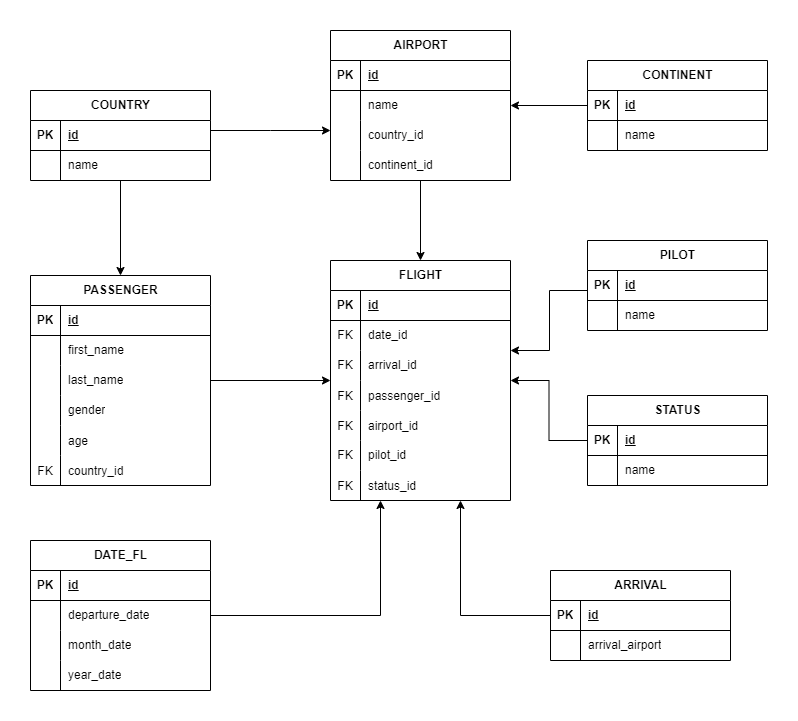

# 1) DIAGRAMA DEL MODELO


# 2) MANUAL TÉCNICO

## Tecnología utilizada
* Python 3.12
    * subprocess
    * pandas
    * pyodbc
* SQL Server v2017

## Directorio
```bash
practica1/
    |── data/
        └── misdatos.csv                # datos a leer
    └── db/
        ├── resultados/                 # resultado de las consultas
            └── ... consulta.txt 1-10       
        └── scripts/                    # scripts de las consultas solicitadas
            └── ... consulta.sql 1-10            
        └── eliminar_modelo.sql         # script para eliminar el modelo
        └── crear_modelo.sql            # script para crear el modelo
        ├
        └── cargar_informacion.sql      # script para cargar la informacion de 
                                        # la tabla temporal al modelo

    ├── main.py                         # menu principal
    ├── readfile.py                     # carga de datos a tabla temporal
    └── consultas.py                    # menu de consultas
```

## Modelo utilizado
El modelo utilizado fue el modelo copo de nieve, inicialmente se trató de hacer un modelo estrella pero para normalizar la tabla de AIRPORT se decidió cambiar el modelo al mencionado anteriormente.

### Tabla de hechos
* FLIGHT

### Tablas de dimensiones
* AIRPORT
    * COUNTRY
    * CONTINENT
* PILOT
* STATUS
* ARRIVAL
* DATE_FL
* PASSENGER
    * COUNTRY