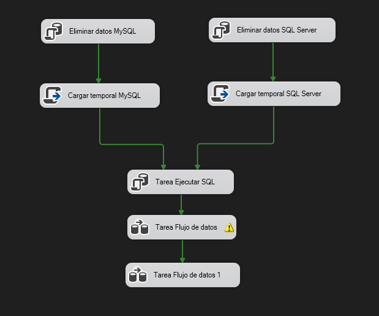
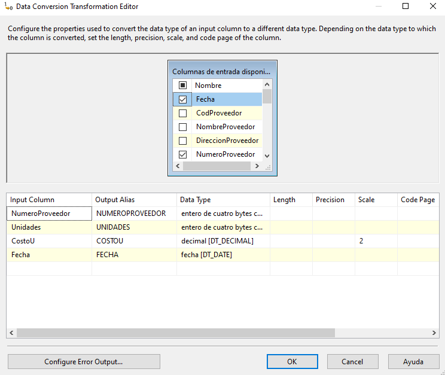
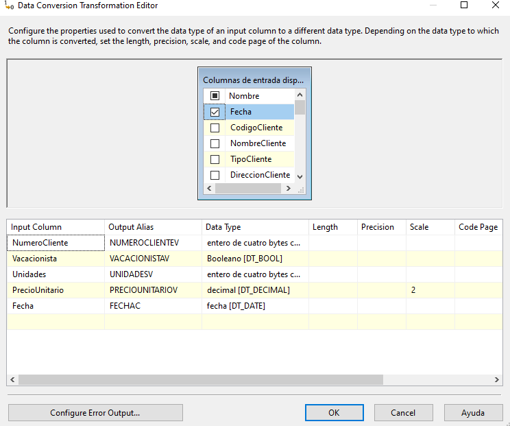
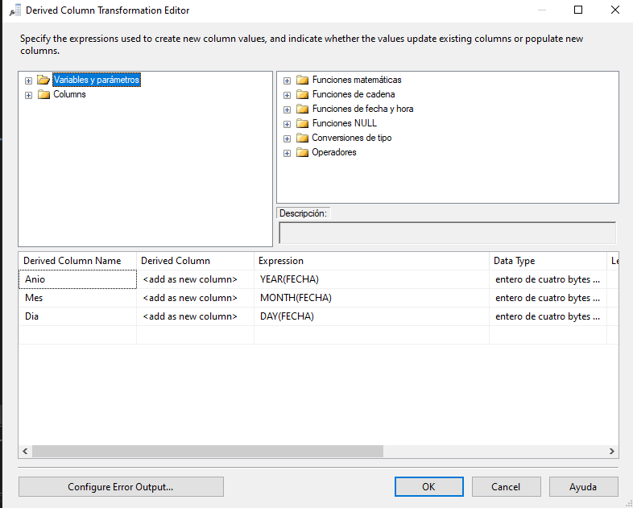
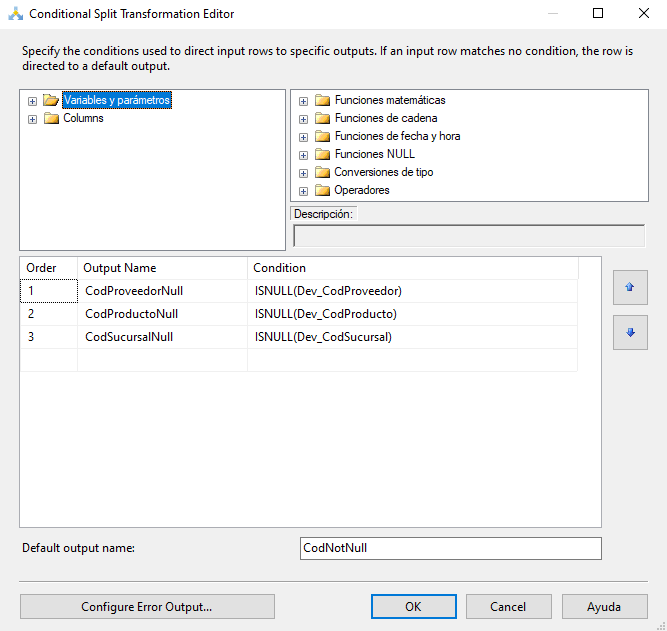
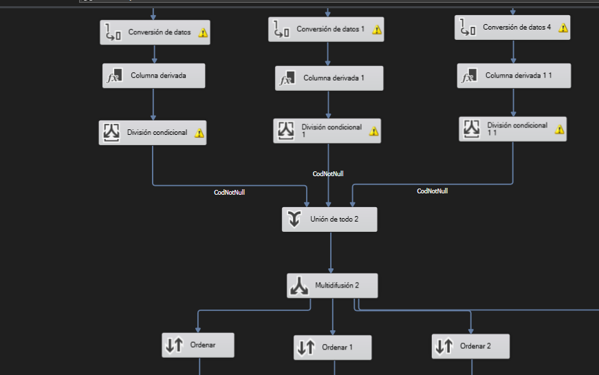
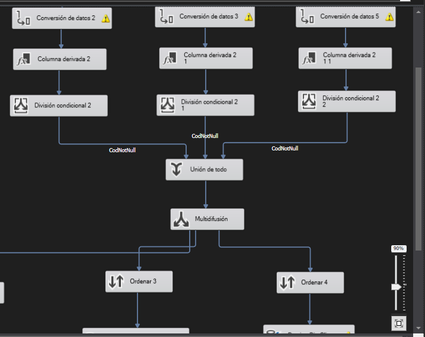
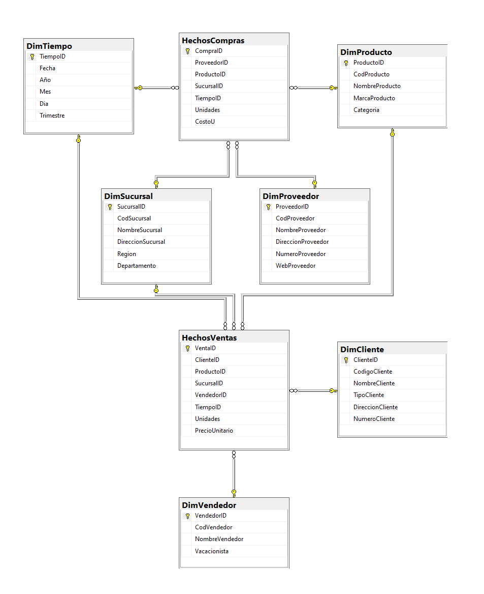

# SG-Food

## Aplicación de ETL
* Se utilizaron Task Script para la lectura de los archivos

* Se aplicó la herramienta de Conversión de datos para la transformación de datos

* También se utilizó columnas derivadas para transformar datos

* Para limpiar los datos también se utilizaron divisiones condicionales y ordenamiento

## Modelo DataWareHouse

Se utilizó el modelo constelación ya que se encontraron dos tablas de hechos siendo estas los registros de ventas y compras.

Para cada tabla de hechos se usaron tablas de dimensiones como clientes, proveedores, productos y sucursales. Donde el producto es compartido entre las dos tablas de hecho ya que es el ente principal de las transacciones.

Adicional se agregó una tabla Tiempo como una dimensión compartida. Esto debido a que ambas tablas de hechos tienen una fecha de la trasacción y para mantener únicamente datos de tipo númericos en dichas tablas, se optó por crear una tabla para las fechas, diviendo esta en año, mes y día.